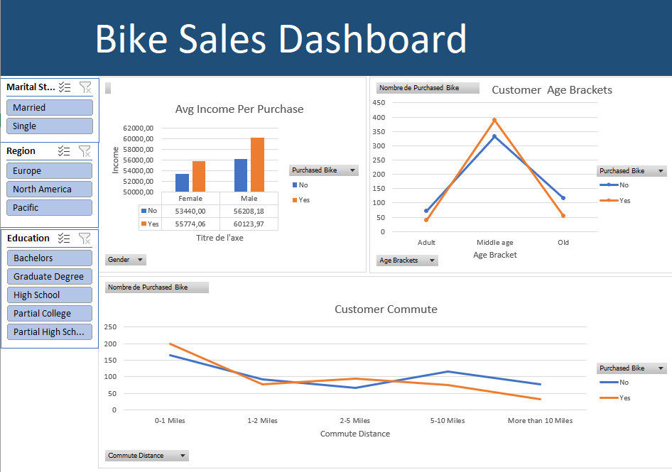

# Bike Sales Data Analysis Dashboard

## Project Overview
This project analyzes a dataset of 1,000 customers to identify trends in bike purchases based on demographics such as income, age, and commute distance.

## Interactive Dashboard

## Key Features
* **Data Cleaning :** Remove duplicates, Standardized marital status, gender, and currency.
* **Age Segmentation:** Categorized customers into Adult, Middle-Aged, and Old.
* **Slicers:** Added interactive filters for Region, Education, and Marital Status.
* **Visualizations:** Created charts for Average Income per Purchase and Customer Age Brackets.
